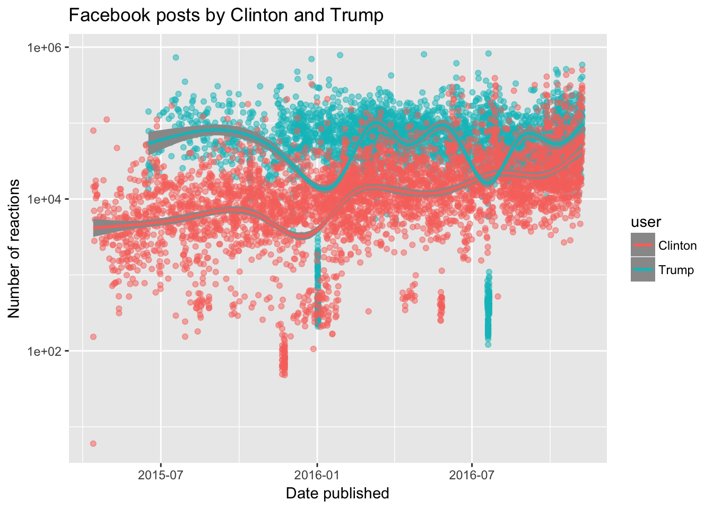

MATH 216 Data Science Final Project (Fall 2016)
================

Name: Nina Sonneborn   
Project title: Facebook Posts from Donald Trump and Hillary Clinton during their campaigns   
Write-up on RPubs: <http://rpubs.com/nsonneborn/fp>    
Abstract: I investigated whether the following variables had any effect on the popularity of a post, as measured by the number of reactions. 
* The proportion of total reactions that is a certain type (like, love, wow, haha, sad, angry) 
* Status type (status, video, photo, link) 
* Time of publication 
* Trends in national polling averages 
* A key event for each candidate 
* Trump’s posts including the words “Crooked Hillary” in the post
In the end, most of the variables didn’t show any significant correlation. This report will offer an analysis of each of these variables, as well some suggestions as to what variables might be better to look at.

